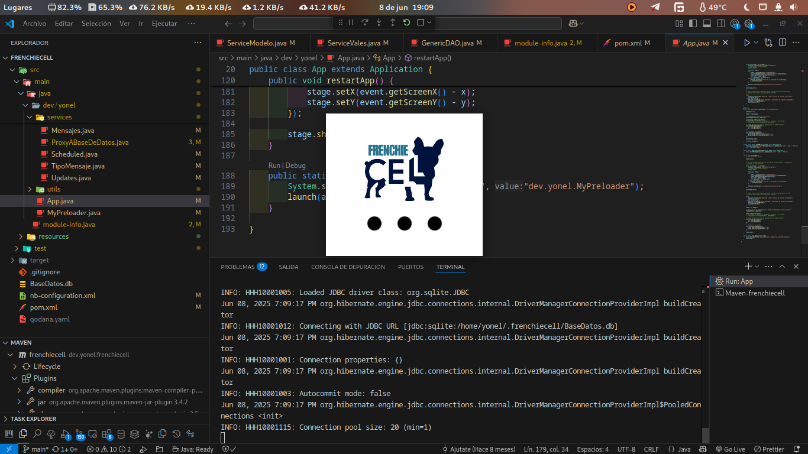
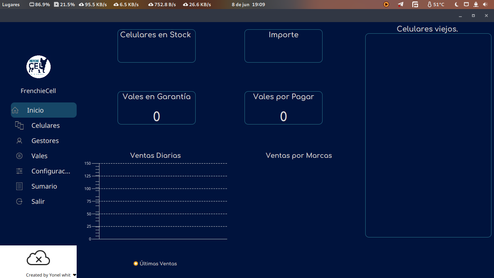
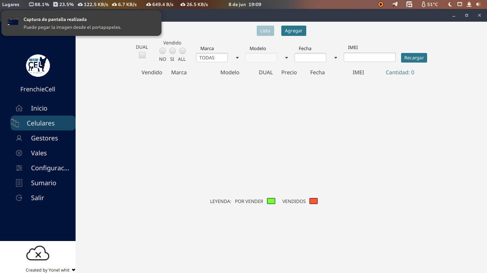
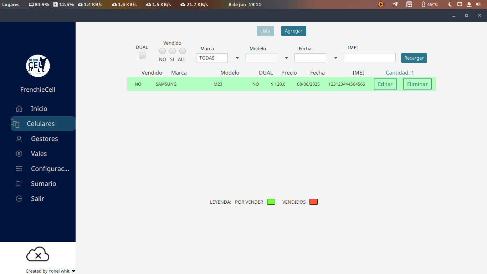
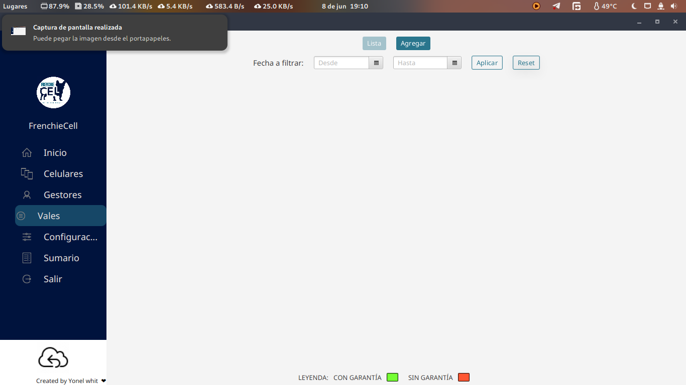
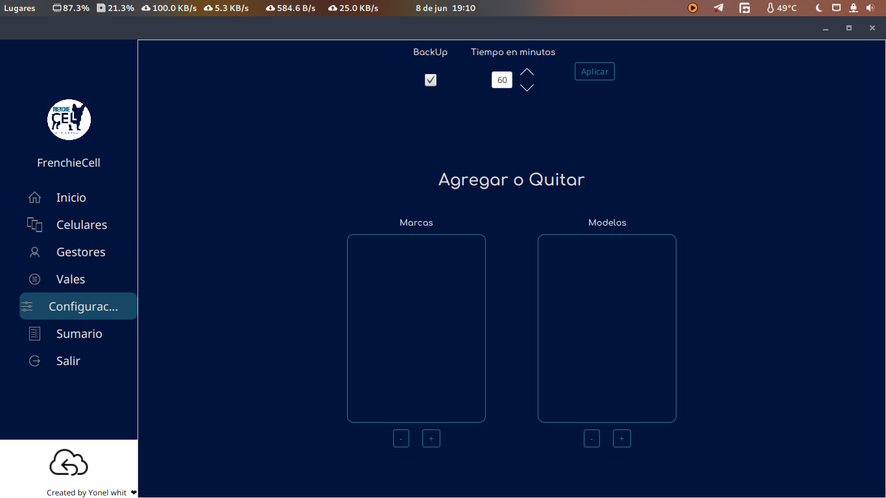

# 🛒 FrenchieCell - Sistema de Gestión para Tienda Móvil


> ⚠️ **Proyecto educativo** desarrollado durante mi proceso de aprendizaje con JavaFX. No esta terminado, esto solo es una muestra de mi evolución.

---

## 📌 Descripción

**FrenchieCell** es un sistema de gestión para la tienda de celulares FrenchieCell desarrollado con JavaFX y la librería [MaterialFX](https://github.com/palexdev/MaterialFX) de PalexDev, la cual proporciona una interfaz moderna y componentes inspirados en Material Design. Este proyecto fue desarrollado para consolidar mis conocimientos en arquitectura (MVC), diseño de interfaces, e integración de servicios externos.

### Funcionalidades destacadas:
- 📦 Gestión de inventario de celulares
- 🧾 Registro y control de ventas
- 👨‍💼 Administración de promotores
- 📊 Dashboard con estadísticas visuales
- ☁ Integración con Dropbox para respaldos automáticos

---

## 🛠 Tecnologías Utilizadas

### Core
- **Java 17** + **JavaFX 19**
- **Hibernate ORM**
- **SQLite** (Base de datos embebida)

### UI/UX
- **MaterialFX** (Componentes modernos)
- **CSS personalizado**
- **Animaciones y transiciones**
- **FontAwesome / ControlsFX**

### Integraciones
- **Dropbox API**
- **Hibernate Validator**
- **JUnit 5** (para pruebas unitarias)

---

## 🗂 Estructura del Proyecto

```
src/
├── main/
│   ├── java/
│   │   └── dev/yonel/
│   │       ├── controllers/         # Controladores de vistas
│   │       ├── models/              # Entidades del negocio
│   │       ├── services/            # Lógica del negocio
│   │       │   ├── clouds/          # Integración con Dropbox
│   │       │   └── controllers/     # Servicios para controladores
│   │       └── utils/               # Utilidades generales
│   └── resources/
│       ├── css/                     # Estilos CSS
│       ├── fonts/                   # Tipografías
│       ├── images/                  # Imágenes y logotipos
│       └── view/                    # Archivos FXML
```

---

## 🖼 Capturas













---

## 🚧 Estado Actual

| Módulo                        | Estado     |
|------------------------------|------------|
| CRUD de celulares            | ✅ Completo |
| Sistema de ventas básico     | ✅ Listo    |
| Integración con Dropbox      | ⚠ Parcial  |
| Dashboard de métricas        | 🚧 En curso |
| Documentación                | ❌ Pendiente |

---

## 📚 Lo que he aprendido

```diff
+ JavaFX con arquitectura MVC
+ Styling profesional con CSS moderno
+ Integración con APIs externas (Dropbox)
+ Patrones de diseño aplicados (DAO, Singleton, etc.)
+ Persistencia con Hibernate y validaciones
```

---

## ⚙ Requisitos

- JavaFX JDK 17+
- Maven 3.8+
- (Opcional) Credenciales de Dropbox para backups

---

## 💬 Nota para Reclutadores

Este proyecto lo realice para consolidar mis conocimientos en JavaFX.

📩 Estoy abierto a **feedback** y **oportunidades de colaboración profesional**.
---

**Yonel Jorge Sánchez Cantillo**  
Autodidacta | Desarrollador Java | Ex-médico